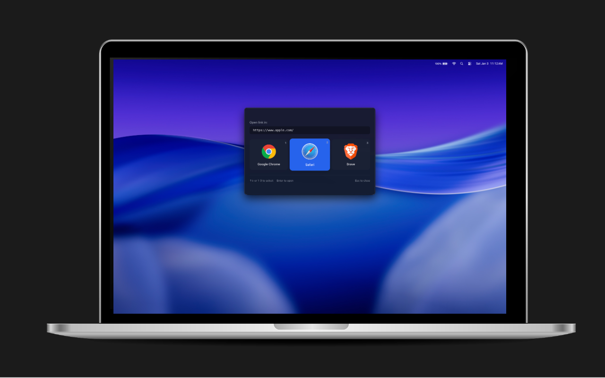

# BrowserPort

**BrowserPort** is a modern, cross-platform desktop utility that gives you control over your links.



Instead of opening every link in the same default browser, BrowserPort registers itself as your OS default. When you click a link in Slack, Discord, or your Terminal, BrowserPort appears as a lightweight, floating widget, letting you instantly choose the right browser for the job.

## Why?

If you are a developer or power user, you likely have multiple browsers:

- Chrome for development and debugging.
- Arc/Safari for personal browsing.
- Firefox for privacy.
- Edge for corporate intranets.

BrowserPort solves the "Work Link vs. Personal Browser" dilemma.

## Features

- **Cross-Platform**: Works on macOS, Windows, and Linux
- **Protocol Interception**: Registers as default handler for http/https links
- **Fast Browser Detection**: Native filesystem checks for instant startup
- **Modern Widget UI**: Floating, centered, always-on-top interface inspired by Raycast/Spotlight
- **Keyboard Navigation**: Full keyboard support with arrow keys, numbers, and shortcuts
- **Secure Architecture**: Built with Electron security best practices

## Installation

### macOS

1. Download the latest release (`.dmg` or `.app`).
2. Drag BrowserPort to your Applications folder.
3. Open BrowserPort.
4. When prompted, set BrowserPort as your default browser.

### Windows

1. Download the latest installer (`.exe`).
2. Run the installer.
3. Set BrowserPort as your default browser in Windows Settings.

## Usage

Once installed and set as your default browser:

1. Click any link in an external application (Slack, Discord, Terminal, etc.).
2. The BrowserPort window will appear.
3. Select the browser you want to open the link with:
   - Click the browser icon.
   - Use the arrow keys and press Enter.
   - Press the corresponding number key (1-9).

## Tech Stack

- **Electron** - Desktop application framework
- **React** + **TypeScript** - UI with type safety
- **Vite** - Fast build tooling
- **Tailwind CSS** - Modern styling

## Development

### Prerequisites

- Node.js 18+ (or 20+)
- pnpm

### Setup

```bash
# Install dependencies
pnpm install

# Run in development mode
pnpm electron:dev

# Build for production
pnpm electron:build
```

### Code Signing (macOS)

For proper distribution on macOS without security warnings, the app must be code-signed and notarized with an Apple Developer certificate.

## Project Structure

```
BrowserPort/
├── src/
│   ├── main/               # Electron main process
│   │   ├── index.ts        # Main entry point
│   │   └── browserManager.ts  # Browser detection logic
│   ├── preload/            # Preload scripts
│   │   └── index.ts        # contextBridge API
│   └── renderer/           # React UI
│       ├── App.tsx         # Main UI component
│       ├── main.tsx        # React entry point
│       └── index.css       # Global styles
├── vite.config.ts          # Vite configuration
└── package.json
```

## Security

This application follows Electron security best practices:

- ✅ `contextIsolation: true`
- ✅ `nodeIntegration: false`
- ✅ `sandbox: true`
- ✅ IPC via `contextBridge` only

## License

[BSD-3-Clause](LICENSE)
